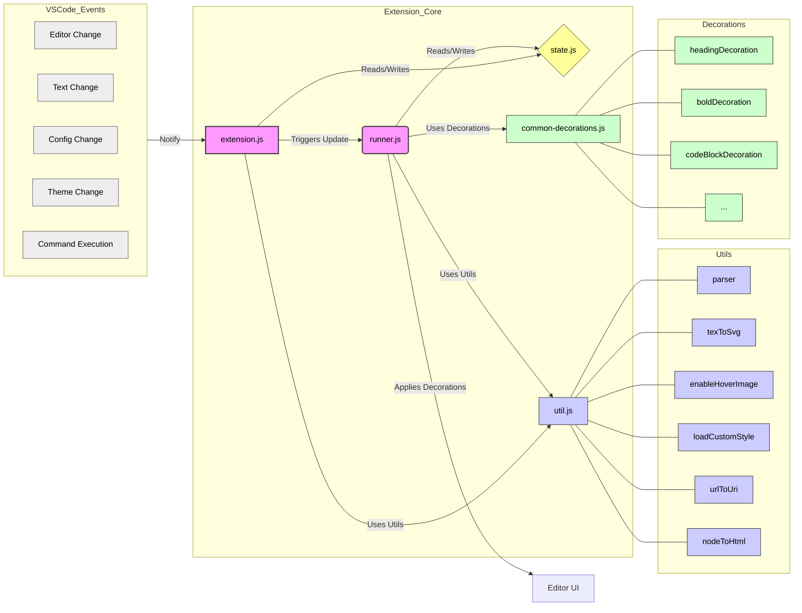

我已经分析了 Markless VS Code 扩展的代码。以下是主要发现：

核心文件及其作用:

src/extension.js: 扩展入口，负责激活、停用、命令注册和事件监听。
src/runner.js: 核心渲染引擎，负责解析 Markdown、应用装饰、处理更新。
src/common-decorations.js: 定义内置 Markdown 元素的视觉样式（Decorations）。
src/state.js: 全局状态管理，存储共享数据（编辑器、配置、文本等）。
src/util.js: 工具函数库，提供 Markdown 解析、TeX 转 SVG、URL 处理、自定义样式加载等辅助功能。
文件关系:

extension.js 监听 VS Code 事件并触发 runner.js 进行渲染。runner.js 使用 util.js 的解析器和工具函数，引用 common-decorations.js 的样式，并读写 state.js 中的全局状态，最终将装饰应用到编辑器。

### 核心函数:

activate (extension.js): 初始化扩展，设置监听。
updateDecorations (runner.js): 触发渲染流程。
parseAndDecorate (runner.js): 解析文本为 AST 并启动装饰计算。
decorateNode (runner.js): 递归处理 AST 节点，映射到具体装饰。
applyDecorations (runner.js): 将计算好的装饰应用到编辑器 UI。
parser, texToSvg, nodeToHtml, etc. (util.js): 提供核心处理逻辑所需的具体功能。
Mermaid 流程图:

这个分析应该能帮助你理解项目的整体结构，为后续修改代码提供基础。